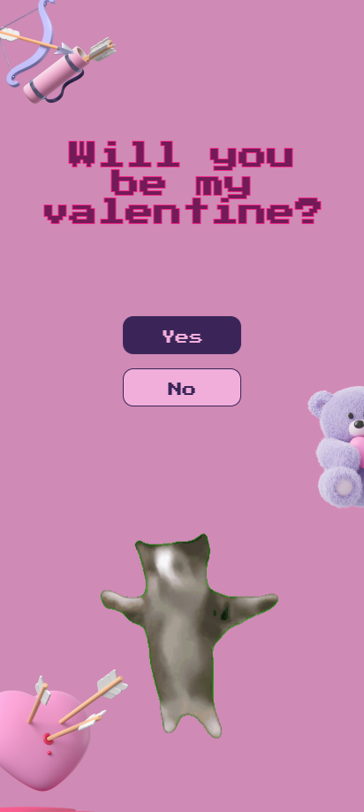

# 🎉 Happy Happy Happy

<div align="center">


[](https://happy-happy-happy.vercel.com)
[](https://reactjs.org/)
[](https://www.typescriptlang.org/)
[](https://vitejs.dev/)

### 🌟 A minimalistic and simple but joyful digital birthday present for your special someone 🌟

</div>

---

## 🎁 What is this?

This project is a **magical digital birthday gift** that you can customize with your own images and messages. It includes stunning animations, interactive elements, and a playful design to make your birthday gift absolutely **unforgettable**! 

Perfect for surprising someone special on their birthday with a personalized, interactive web experience.

## ✨ Features

<table>
<tr>
<td width="50%">

### 🎪 Interactive Elements
- 🎁 **Interactive Gift Box** - Click to reveal a birthday surprise
- 🎵 **Sound Effects** - Famous cat meme sound feedbacks
- 📱 **Mobile Friendly** - Works perfectly on all devices
- 🎨 **Beautiful Animations** - Smooth and delightful interactions

</td>
<td width="50%">

### 🎆 Visual Effects
- 💖 **Heart Rain Animation** - Falling hearts for celebration
- 🎊 **Confetti Animation** - Burst of joy and colors
- 📝 **Customizable Messages** - Personalize birthday messages
- 🌈 **Responsive Design** - Looks great on any screen size

</td>
</tr>
</table>

## 🖼️ Preview

<div align="center">
  
  
  
</div>

## 🚀 Quick Start

### Prerequisites
- 📦 Node.js (v18 or higher)
- 🧶 npm or yarn package manager

### Installation

```bash
# 1️⃣ Clone the repository
git clone https://github.com/Priyanshu84iya/happy-happy-happy.git

# 2️⃣ Navigate to project directory  
cd happy-happy-happy

# 3️⃣ Install dependencies
npm install

# 4️⃣ Start development server
npm run dev
```

### 🎯 Available Scripts

| Command | Description | Icon |
|---------|-------------|------|
| `npm run dev` | Start development server | 🚀 |
| `npm run build` | Build for production | 📦 |
| `npm run preview` | Preview production build | 👀 |
| `npm run lint` | Run ESLint | 🔍 |

## 🛠️ Tech Stack

<div align="center">

| Frontend | Build Tool | Styling | TypeScript |
|----------|------------|---------|------------|
|  |  |  |  |

</div>

## 🎨 Customization

### 🖼️ Replace Images
Simply replace the images in the `/public/assets/` directory with your own:
- `happy.gif` - Celebration animation
- `crying.gif` - Sad reaction animation  
- `bear.png`, `heart.png`, etc. - Decorative elements

### 📝 Edit Messages
Modify the birthday messages in:
- `src/App.tsx` - Main question text
- `src/components/GiftPage.tsx` - Gift messages

## 🌐 Deployment

### Deploy to Vercel (Recommended)
1. Push your code to GitHub
2. Connect your repo to [Vercel](https://vercel.com)
3. Deploy automatically! 🚀

### Manual Build
```bash
npm run build
# Upload the 'dist' folder to your hosting provider
```

## 🤝 Contributing

Contributions are what make the open source community such an amazing place to learn, inspire, and create! 

1. 🍴 Fork the Project
2. 🌿 Create your Feature Branch (`git checkout -b feature/AmazingFeature`)
3. ✅ Commit your Changes (`git commit -m 'Add some AmazingFeature'`)
4. 📤 Push to the Branch (`git push origin feature/AmazingFeature`)
5. 🎯 Open a Pull Request

## 💖 Show Your Support

If this project helped you create something special, please consider:

- ⭐ **Star this repository**
- 🍴 **Fork it for your own projects** 
- 📢 **Share it with friends**
- 🐛 **Report bugs or suggest features**

## 📬 Contact

**Priyanshu84iya** - [GitHub Profile](https://github.com/Priyanshu84iya)

🌐 **Live Demo:** [https://happy-happy-happy.vercel.com](https://happy-happy-happy.vercel.com)

---

<div align="center">

**Made with 💖 and lots of ☕**

*"The best gifts come from the heart, but a little code makes them extra special!"* 🎁

[](https://star-history.com/#Priyanshu84iya/happy-happy-happy&Date)

</div>
